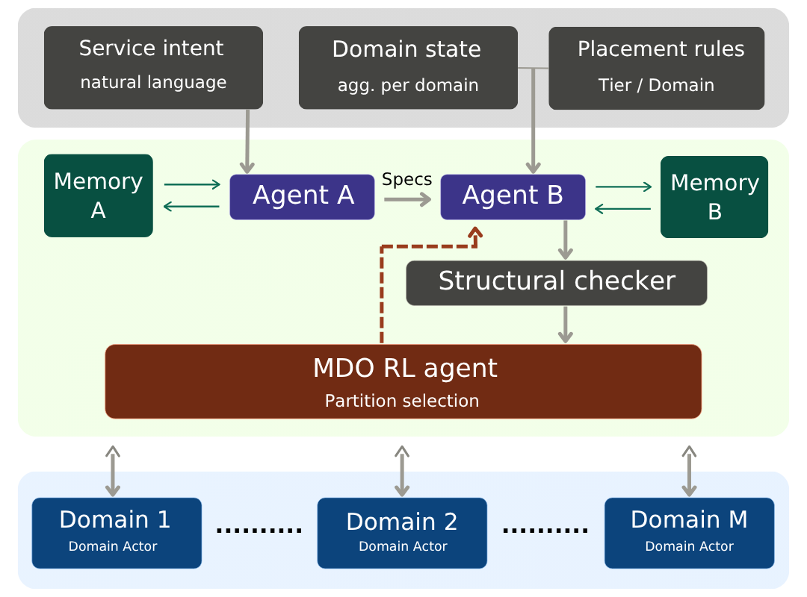

# ORION

**Slice Orchestrator Assistant for Multi-Domain 6G Network Slicing.**

ORION places 5G/6G network slices across several administratively separate
infrastructure domains. A slice arrives as a chain of virtual network functions
with a delay budget and a throughput floor; the system decides which domain hosts
each function, which node inside that domain runs it, and how the traffic between
them is routed, then admits or rejects the slice.

The question the project exists to answer is whether a language model that plans
at the *abstract* level can improve a reinforcement-learning placement policy
operating under **partial observability**, and by how much against baselines that
are told the same or more.



---

## Architecture

Three layers, each seeing strictly less of the substrate than the one below it:

| layer | decides | what it can see |
| --- | --- | --- |
| **Agent A / Agent B** (LLM) | an abstract plan: which *domain* each function should go to | an abstract topology summary, plus retrieved exemplars from episodic memory |
| **MDO coordinator** (RL) | the committed partition of the chain across domains | per-domain aggregates and a per-tier largest-free-node statistic. **Never node residuals** |
| **Domain actors** | which *node* runs each function, and the intra-domain route | the full state of their own domain only |

The partial observability of the middle layer is the point, not a limitation: a
real multi-domain orchestrator does not get to read its neighbours' inventories.

### Constraints

Admission is decided by a ground-truth verifier, not by the policy that proposed
the placement. A plan the coordinator commits can still be refused:

| | constraint |
| --- | --- |
| C2 / C3 | node CPU and RAM capacity |
| C5 | link bandwidth |
| C5b | end-to-end throughput floor |
| C7 | end-to-end delay budget, under load-dependent M/M/1 sojourn |
| C8 | tier feasibility |
| C9 | inter-domain hop limit |
| C10 | chain-order contiguity: a chain may not re-enter a domain it has left |

C7 most often decides the outcome, and it is why colocating a whole chain on one
node is not free: node sojourn is charged per function at the shared node and
grows superlinearly with utilisation.

---

## Getting started

```bash
python -m venv .venv && . .venv/bin/activate      # Windows: .venv\Scripts\activate
pip install -e ".[dev]"
PYTHONHASHSEED=0 pytest -q
```

**[USAGE.md](USAGE.md) is the operating guide.** It covers setting up the LLM
server, running experiments and every flag, the approach registry, how to read a
result cell, recalibrating and freezing the load ladder, adding an approach, the
reproducibility rules, and a troubleshooting table. Start there.

---

## Repository layout

```
src/orion/
  substrate/     topology generator and the substrate graph
  sim/           arrival process, verifier, delay model, reward, load levels,
                 partition oracle
  mdo/           coordinator, partition policy, observation, C10, admissibility
  actors/        domain actors, routing, action masks
  llm/           Agent A/B, episodic + semantic memory, plan cache
  training/      PPO, GAE, critic, buffers
  baselines/     colocation-first FFD and greedy FFD
scripts/         runners, calibration, diagnostics
tests/           pytest suite
```

Experiment output (`data/`, `results/`, `runs/`, `logs/`) is generated by running
the code and is deliberately not versioned.

## Licence

MIT. See [LICENSE](LICENSE).
