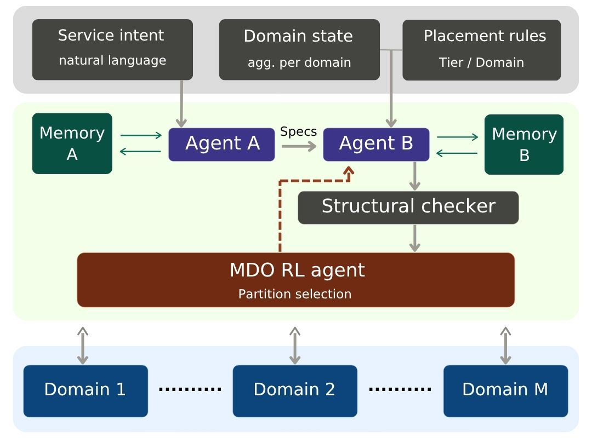

# ORION-v1

ORION is an LLM-guided reinforcement-learning system for admission and placement of
network slices across federated administrative domains. A language model turns an
operator intent into a structured slice specification and an abstract placement plan;
a PPO-trained Multi-Domain Orchestrator, KL-regularised toward that plan, decides
admission and partitions the plan across domains; behaviour-cloned per-domain actors
place within each domain.

## Citation

See `CITATION.cff`.

## License

MIT. See `LICENSE`.
